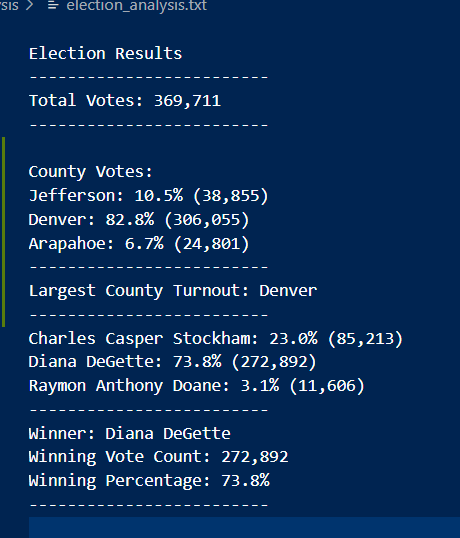

# Election_Analysis
## Project Overview
A Colorado Board of Elections employee has given you the following tasks to complete the election audit of a recent local congressional election.
1. Calculate the total number of votes cast.
2. Get a complete list of candidates who received votes.
3. The total number of votes per county.
4. Calculate the total number of votes each candidate received.
5. Calculate the percentage of votes each candidate won.
6. Determine the winner of the election based on popular vote.
## Resources
- Data Source: election_results.csv
- Software: Python 3.6.1, Visual Studio Code, 1.38.1
## Election-Audit Results
1. How many votes were cast in this congressional election?
- There were 369,711 votes cast in the election.
2. Provide a breakdown of the number of votes and the percentage of total votes for each county in the precinct.
- Jefferson received 10.5% of the vote and 38,855 number of votes.
- Denver received 82.8% of the vote and 306,055 number of votes.
- Arapahoe received 6.7% of the vote and 24,801 number of votes.
3. Which county had the largest number of votes?
- Denver
4. Provide a breakdown of the number of votes and the percentage of the total votes each candidate received.
- Charles Casper Stockman received "23%" of the vote and "85,213" number of votes.
- Diana DeGette received "73.8%" of the vote and "270,892" number of votes.
- Raymon Anthony Doane received "3.1%' of the vote and "11,606" number of votes.
5. Which candidate won the election, what was their vote count, and what was their percentage of the total votes?
- Diana DeGette received "73.8%" of the vote and "270,892" number of votes.

## Summary
    - Diana DeGette received "73.8%" of the vote and "270,892" number of votes.
    The possibilities to change the code are endless. A few of them will be adding the gender, age group and ethnicity. 
    
